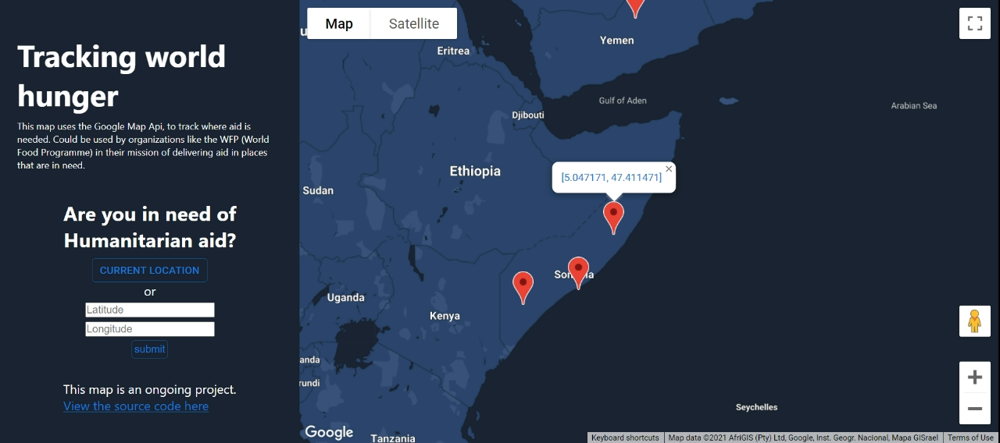
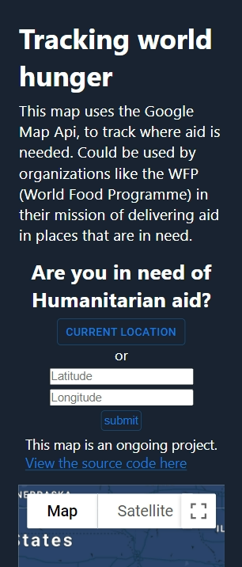
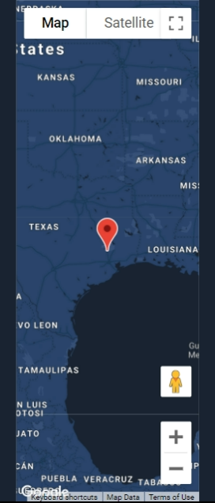

# Aid Map 

A website that uses a map api to mark locations on a map. These mark locations represent places that need humanitarian aid in the form of food or water. Hence, these markers can be used to airdrop supplies in places that are in need.   

- Created using React

## Features

- Google Map APi 
- React Hooks
- Geolocation

### `npm start`

Runs the app in the development mode.\
Open [http://localhost:3000](http://localhost:3000) to view it in the browser.

The page will reload if you make edits.\
You will also see any lint errors in the console.

### More pictures

